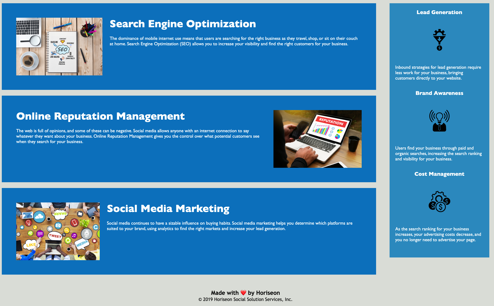

# Module 1 Challenge - Update codebase to reflect accessibility standards

Marketing agency wants a codebase that follows accessibility standards so that their website is optimized for search engines.

## View the source code and update HTML to semantic elements.

* When I first viewed the code I noticed that it didn't have semantic elements, code was wrapped in the div element (non-semantic). I updated all the divs to semantic elements using the header, footer, section, article, and aside elements.

## View the structure of the HTML elements and follow a logical structure independent of styling and positioning.

* This looked pretty spot on. Everything looks like it's in the right order and follows the styling of the web page.

## Find the image elements and add accessible alt attributes to them.

* Added the alt attribute to the three main column images with a detailed description of each image.

## Find and verify the heading attributes that they fall in sequential order.

* Moved the <link> below the title.

## Find and verify the title element has a concise, descriptive title.

* Updated title from "website" to the company name "Horiseon".

## Assets

The following image demonstrates the web application's appearance and functionality:

# GitHub repository for challenge 1
[Github Repo](https://github.com/joliver521/horiseon)

# Live website for challenge 1
[Live Horiseon website](https://joliver521.github.io/horiseon/)